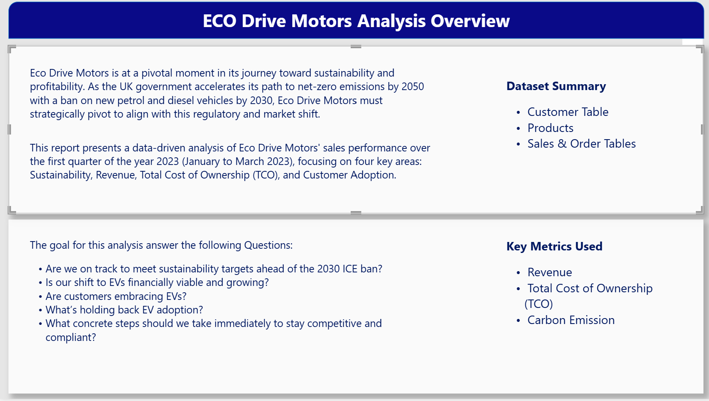
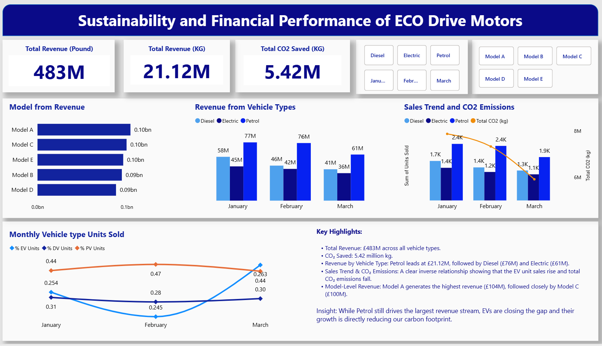
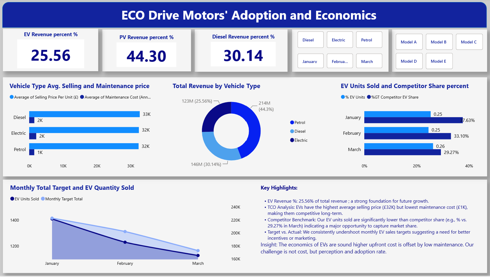
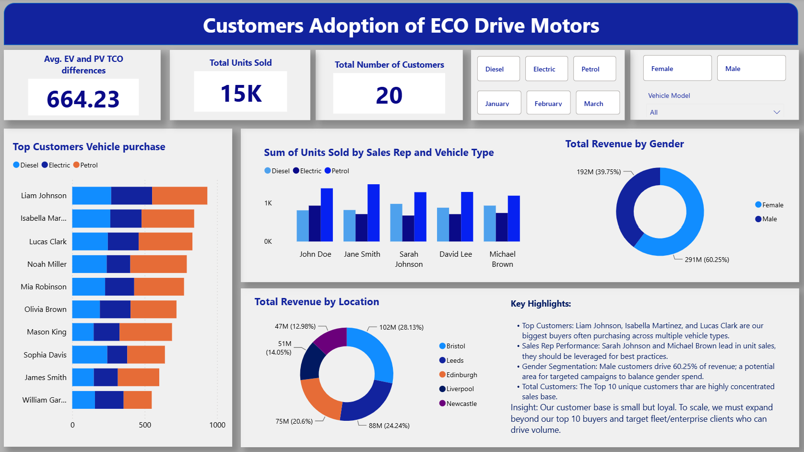
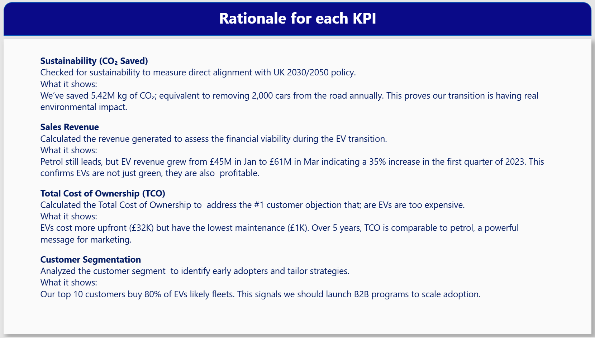
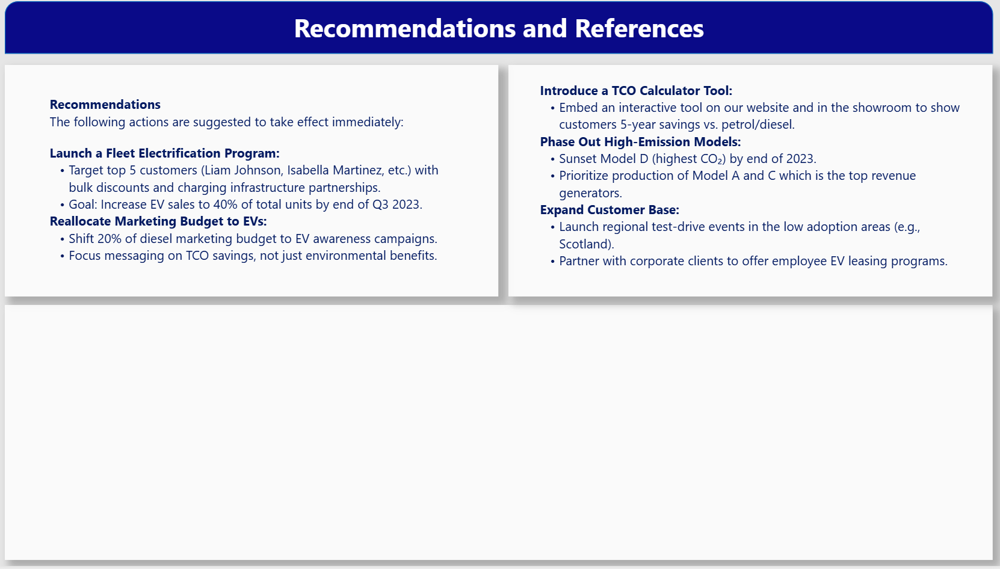

# 🚗 Eco Drive Motors — Power BI Sales & EV Analysis

## 📊 Project Overview

Eco Drive Motors is transitioning toward a more sustainable vehicle portfolio as the automotive market shifts toward electric vehicles (EVs).

This project uses **Power BI** to analyze Q1 2023 sales performance across vehicle types, products, customers, and locations. The analysis focuses on four key areas:

- Sustainability and CO₂ reduction
- Revenue and financial performance
- EV adoption and economics
- Customer purchasing behavior

The goal is to identify trends, understand barriers to EV adoption, and provide data-driven recommendations to support the company's transition toward a more sustainable and commercially viable vehicle portfolio.

---

## 🎯 Business Questions

The analysis addresses the following questions:

- Are EV sales growing?
- How does EV revenue compare with petrol and diesel vehicles?
- What is the relationship between vehicle sales and CO₂ emissions?
- Are EVs financially competitive based on selling price and maintenance costs?
- Are customers adopting EVs at the expected rate?
- Which customers, locations, and vehicle types generate the most revenue?
- What actions could accelerate EV adoption?

---

## 🛠️ Tools & Technologies

- **Microsoft Power BI**
- **Power Query**
- **DAX**
- Data modelling
- Data visualization
- KPI analysis
- Business intelligence

---

## 📈 Key KPIs

| KPI | Result |
|---|---:|
| Total Revenue | £483M |
| Total CO₂ Saved | 5.42M kg |
| EV Revenue Share | 25.56% |
| Petrol Revenue Share | 44.30% |
| Diesel Revenue Share | 30.14% |
| Total Units Sold | 15K |
| Customers | 20 |
| Average EV & PV TCO Difference | 664.23 |

---

## 🔍 Key Findings

### Sustainability & Financial Performance

- Total revenue across the analyzed period was **£483M**.
- The analysis recorded approximately **5.42M kg of CO₂ saved**.
- Petrol generated the largest revenue share at **44.30%**.
- EV revenue increased from approximately **£45M in January to £61M in March**.

### EV Adoption & Economics

- EVs generated approximately **25.56% of total revenue**.
- Average EV selling price was approximately **£32K**, while annual maintenance cost was approximately **£1K**.
- EV unit sales remained below the monthly targets shown in the dashboard.
- Competitor EV share remained substantially higher than Eco Drive Motors' EV unit share during the analyzed months.

### Customer Adoption

- Revenue was concentrated among a relatively small number of customers.
- Several high-value customers purchased across multiple vehicle types.
- Revenue varied across the analyzed locations, with Bristol contributing the largest share in the dashboard.
- The analysis indicates an opportunity to expand beyond the existing high-value customer base.

---

## 💡 Recommendations

Based on the analysis, the following actions were identified:

### 1. Launch a Fleet Electrification Program

Target high-value customers and business/fleet clients with tailored EV offers and infrastructure partnerships.

### 2. Increase EV Marketing

Redirect part of the conventional vehicle marketing budget toward EV awareness and education.

Focus messaging on:

- Total Cost of Ownership
- Financial benefits
- Environmental benefits

### 3. Introduce a TCO Calculator

Provide customers with an interactive tool that compares long-term ownership costs between EV, petrol, and diesel vehicles.

### 4. Review High-Emission Models

Evaluate the future production strategy for the highest-emission vehicle models and prioritize models generating strong revenue.

### 5. Expand the Customer Base

Use regional test-drive events and corporate partnerships to reach customers beyond the existing high-value customer group.

---

## 📊 Dashboard Preview

### 1. Overview

### 2. Sustainability & Financial Performance

### 3. EV Adoption & Economics

### 4. Customer Adoption

### 5. KPI Rationale

### 6. Recommendations

---

## 📌 Project Scope

**Period:** Q1 2023 (January–March 2023)

**Focus:** Automotive sales, sustainability, EV adoption, customer behavior, and financial performance.

This project demonstrates how Power BI can be used to transform business data into actionable insights for strategic decision-making.

---

## 🛠️ Tools & Skills

- **Power BI** — Dashboard development, data visualization, KPI reporting
- **Data Analysis** — Exploratory analysis, trend analysis, customer analysis
- **Business Analysis** — Revenue, profitability, sales performance, and customer behavior
- **Sustainability Analysis** — CO₂ emissions and environmental performance
- **EV Analysis** — Electric vehicle adoption, economics, and customer adoption
- **Data Storytelling** — Turning business data into actionable insights

---

## 📊 Key Areas Analyzed

- Sales and revenue performance
- Vehicle and product performance
- Customer behavior and adoption
- EV adoption and economics
- Sustainability and CO₂ reduction
- Total Cost of Ownership (TCO)
- Strategic recommendations

---

## 📁 Project Structure

    Eco-Drive-Motors-Analysis/
    │
    ├── README.md
    │
    ├── Dashboard/
    │   ├── 01_Overview.png
    │   ├── 02_Sustainability_Financial_Performance.png
    │   ├── 03_EV_Adoption_Economics.png
    │   ├── 04_Customer_Adoption.png
    │   ├── 05_KPI_Rationale.png
    │   └── 06_Recommendations.png
    │
    └── PowerBI/
        └── Eco Cars Analysis.pbix

---

## 📁 Project Files

- `Dashboard/` — Power BI dashboard screenshots and visual analysis
- `PowerBI/Eco Cars Analysis.pbix` — Power BI project file
- `README.md` — Project documentation

---

## 👤 Author

**Nduamako Ndubuisi Amako**

Data Analyst | Economics | Data Science | Business Intelligence
